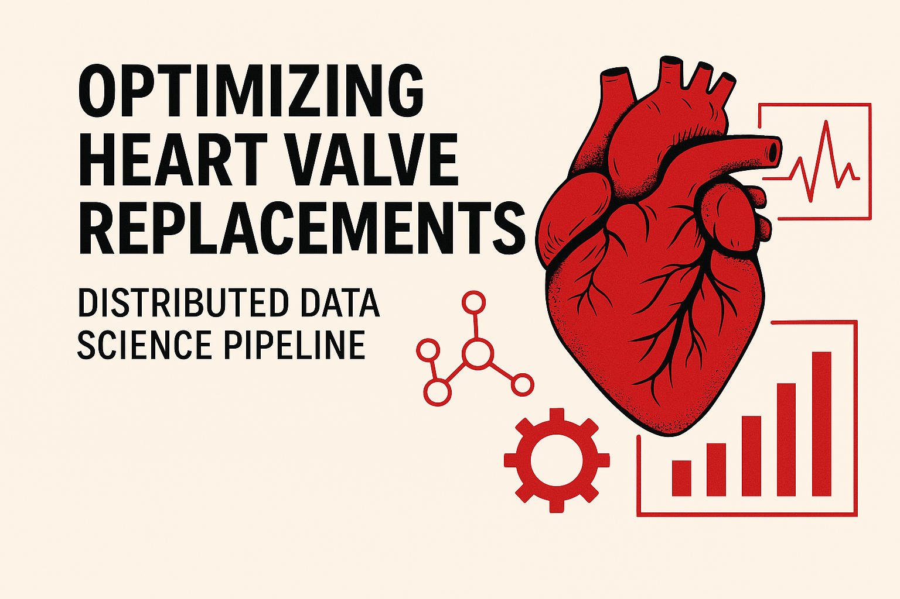
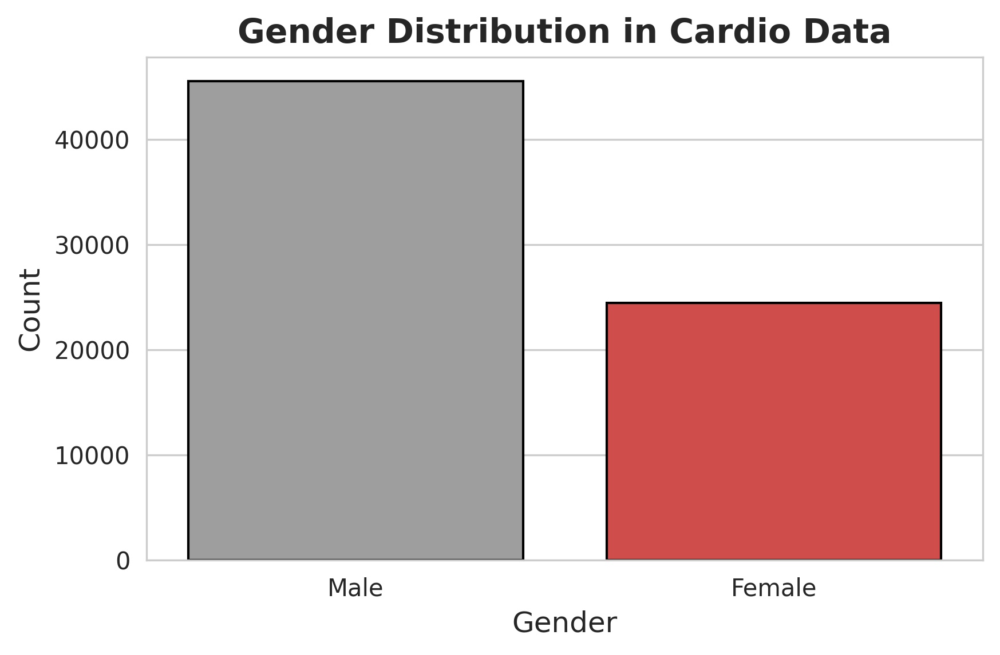
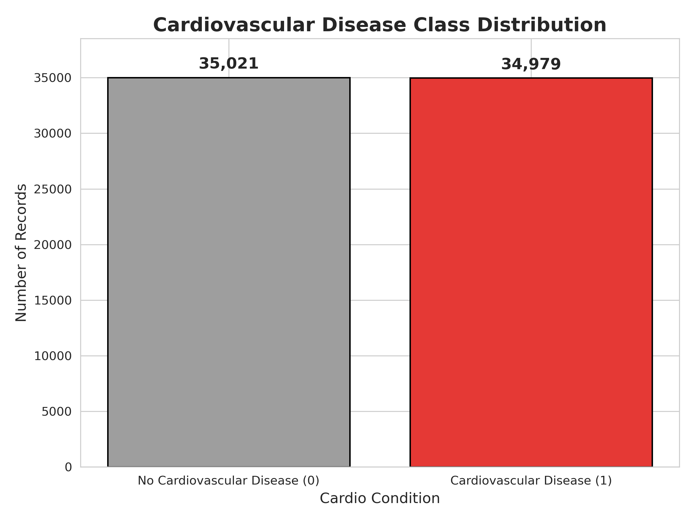
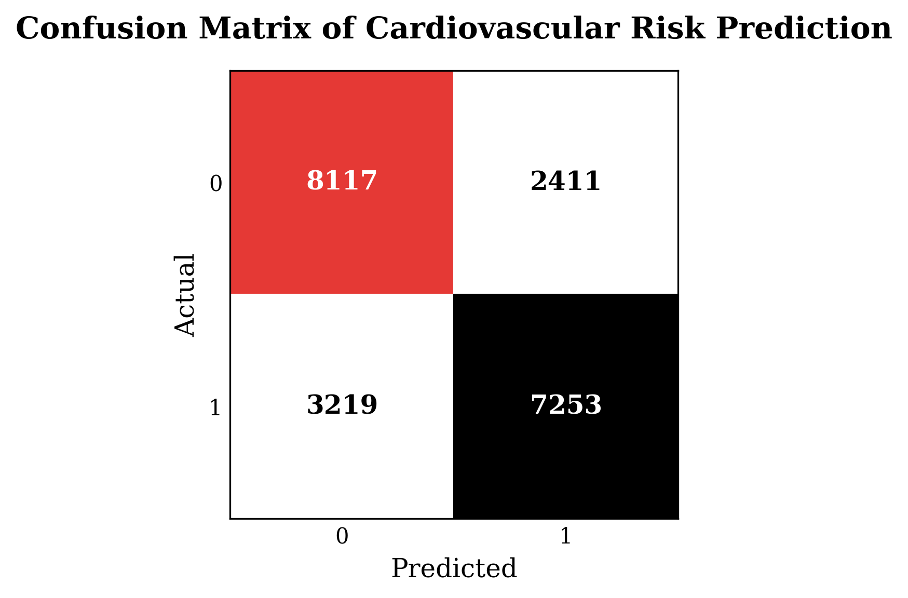

# Optimizing Heart Valve Replacements: Distributed Data Science Pipeline


### 🧠 Project Authors: [Niat Kahsay](https://github.com/NiatKahsay) & [Marwah Faraj](https://github.com/marwahfaraj)  
**Company:** CardioValve Solutions  
**Industry:** Healthcare / Medical Devices  
**Team Size:** Small (20 employees)

---

## 📘 Table of Contents

- [Abstract](#abstract)
- [Problem Statement](#problem-statement)
- [Goals](#goals)
- [Non-Goals](#non-goals)
- [Data Sources](#data-sources)
- [Data Exploration](#data-exploration)
- [Exploratory Data Analysis (EDA)](#exploratory-data-analysis-eda)
- [Data Ingestion](#data-ingestion)
- [Bias Exploration](#bias-exploration)
- [Class Imbalance](#class-imbalance)
- [Impact Measurement](#impact-measurement)
- [Security & Privacy](#security--privacy)
- [Data Preparation](#data-preparation)
  - [Feature Store Validation](#feature-store-validation)
  - [Data Scrubbing](#data-scrubbing)
  - [Feature Selection](#feature-selection)
  - [Feature Creation](#feature-creation)
  - [Feature Transformation](#feature-transformation)
- [Dataset Splits](#dataset-splits)
- [Model Training & Evaluation](#model-training--evaluation)
  - [XGBoost](#xgboost)
  - [Hyperparameters](#hyperparameters)
  - [Instance Configuration](#instance-configuration)
  - [Evaluation Metrics](#evaluation-metrics)
- [Future Enhancements](#future-enhancements)
- [Repository Structure](#repository-structure)
- [References](#references)

---

## 📌 Abstract

CardioValve Solutions develops heart valve implants. To improve clinical decisions and patient outcomes, we built a scalable cloud-based data science pipeline that uses patient and surgery data to predict cardiovascular risk and valve replacement success using AWS SageMaker Autopilot and JumpStart.

---

## 🩺 Problem Statement

Despite collecting high-volume clinical data, CardioValve struggled to identify predictive signals. This led to inefficiencies and variability in treatment outcomes. A distributed pipeline was needed to automate and optimize data modeling and insights at scale.

---

## 🎯 Goals

- Build a distributed data pipeline using AWS tools.
- Identify key risk predictors of cardiovascular complications.
- Improve clinical outcomes using ML-driven insights.

---

## 🚫 Non-Goals

- Designing new heart valve devices.
- Running new clinical trials.
- Integrating data outside of defined sources.

---

## 🗃️ Data Sources

Data is securely hosted on Amazon S3 and used by SageMaker Autopilot for training:

- `cardio_train.csv`
- `Quitline Services Dataset (2010–Present)`

---

## 🔍 Data Exploration

Using AWS Glue + Athena to preprocess and join datasets from S3 into a unified DataFrame. The resulting dataset was visualized and verified in SageMaker Studio.

---

## 📊 Exploratory Data Analysis (EDA)

- Checked for missing values and duplicates.
- Verified plausible ranges (e.g., weight/height).
- Created a **correlation heatmap** and **bar chart** of gender distribution.




---

## 🧪 Data Ingestion

- Stored datasets in `s3://cardiovale-solutions-datascience-pipeline`
- Used Glue and boto3 for ETL processes.

---

## ⚖️ Bias Exploration

Utilized **SageMaker Clarify**:

- Class Imbalance Score: -0.301  
- DPL, KS, TVD: 0.009  
- KL & JS Divergence: 0.000  

---

## 🧬 Class Imbalance

No major imbalance:  
- **Class 0:** 35,021  
- **Class 1:** 34,979  
*Balance ratio: 50.03% / 49.97%*



---

## 📈 Impact Measurement

- Reduced missingness
- Improved data quality scores (valid types, less noise)

---

## 🔐 Security & Privacy

- No PHI, PII, or user behavior stored
- Compliance with HIPAA guidelines
- Encryption & IAM roles enforced

---

## ⚙️ Data Preparation

### ✅ Feature Store Validation
- Verified schema, `event_time`, `split_type`, and identifiers via SageMaker UI.

### 🧼 Data Scrubbing
- Replaced `NaN` in key fields, standardized column names.

### 🧪 Feature Selection
- Chose `age, gender, cholesterol, ap_hi, smoke` among others.

### 🏗️ Feature Creation
- Engineered `BMI`, `State`, and `split_type`.

### 🔄 Feature Transformation
- Scaled features via `StandardScaler`
- Encoded categorical variables for ML training.

---

## 🔀 Dataset Splits

Used `train_test_split(stratify=y)` with a 70-15-15 distribution for fairness and consistency.

---

## 🤖 Model Training & Evaluation

### XGBoost
Trained using **Amazon SageMaker Autopilot**, then validated and enhanced with **SageMaker JumpStart**:

- Handled missing data and moderate class imbalance.
- Outperformed other AutoML candidates including Linear Learner and Tabular Neural Networks.

### 🔧 Hyperparameters

| Parameter            | Value |
|----------------------|-------|
| max_depth            | 6     |
| learning_rate        | 0.3   |
| num_boost_round      | 5000  |
| subsample            | 1     |
| colsample_bytree     | 1     |
| gamma                | 0     |
| min_child_weight     | 1     |
| reg_alpha            | 0     |
| reg_lambda           | 1     |
| early_stopping_rounds | 30   |

### 🖥️ Instance Configuration

- Instance type: `ml.m5.large`
- Number of instances: 2
- No GPU required

### 📊 Evaluation Metrics (Autopilot)

| Metric             | Value |
|-------------------|-------|
| F1 Score          | 0.717 |
| AUC               | 0.793 |
| Accuracy          | 0.726 |
| Precision         | 0.741 |
| Recall            | 0.694 |
| Balanced Accuracy | 0.726 |
| LogLoss           | 0.554 |

### 🧮 Evaluation Metrics (JumpStart)

| Class | Precision | Recall | F1 Score |
|-------|-----------|--------|----------|
| 0     | 0.72      | 0.77   | 0.74     |
| 1     | 0.75      | 0.69   | 0.72     |
| **Avg** | **0.73**  | **0.73** | **0.73**   |

**Confusion Matrix**



JumpStart training confirmed robust convergence and model readiness for deployment with consistent accuracy (0.73) across test splits.

---

## 🚀 Future Enhancements

1. **Real-Time Data Integration** via AWS IoT or Kinesis for continuous risk scoring.
2. **SHAP Explainability** using SageMaker Clarify for transparency and trust.
3. **Multi-Modal Learning**: Combine tabular, clinical notes, and medical images for deeper diagnostics.

---

## 🧾 Repository Structure
```plaintext
ads-508-team/
│
├── athena_queries/
│   ├── 01_Create_Athena_Database_Table.ipynb
│   ├── 02_Register_S3_Table_Schema.ipynb
│   └── 03_Convert_S3_Tables_for_Modeling.ipynb
│
├── data/
│   ├── autopilot_input.csv
│   ├── cardio_train_cleaned.csv
│   ├── processed_cardio.csv
│   └── quitline_services_fixed.csv
│
├── images/
│   ├── correlation_heatmap.png
│   ├── gender_distribution.png
│   ├── boxplot_continuous_features.png
│   ├── class_distribution_counts.png
│   ├── feature_store_schema.png
│   └── confusion_matrix.png
│
├── notebooks/
│   ├── 02_Data_Bias_Analysis.ipynb
│   ├── 03_data_exploration.ipynb
│   ├── 04_Prepare_Data_Cleaning.ipynb
│   ├── 05_create_graphs.ipynb
│   ├── 06_autopilot.ipynb
│   ├── 07_sagemaker_jumpstart.ipynb
│   └── generated_bias_report/
│       ├── analysis_config.json
│       ├── analysis.json
│       ├── report.ipynb
│       ├── report.html
│       └── report.pdf
│
├── requirements.txt
└── README.md
```


📂 View the main notebook here:  
📎 [Autopilot Notebook](https://github.com/NiatKahsay/ads-508-team/blob/main/notebooks/autopiolt_model.ipynb)

---

## 📚 References

- [Amazon Athena](https://aws.amazon.com/athena)
- [Fatmanurkutlu (2024)](https://medium.com/@fatmanurkutlu1/model-evaluation-techniques-in-machine-learning-8cd88deb8655)
- [Kundu (2022)](https://www.v7labs.com/blog/f1-score-guide)
- [Moore & Bell (2022)](https://pmc.ncbi.nlm.nih.gov/articles/PMC9647306)
- [Menon (2020)](https://medium.com/analytics-vidhya/stratified-sampling-in-machine-learning-f5112b5b9cfe)

---

> *Deploying scalable, interpretable, and real-world-ready cardiovascular risk models using SageMaker Autopilot and JumpStart.*
